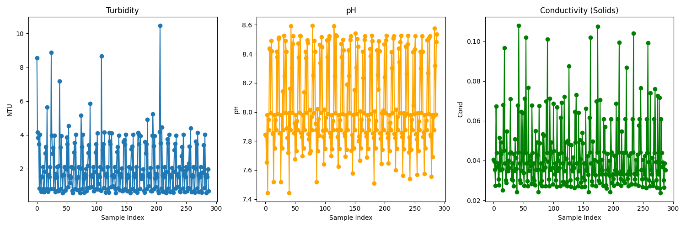
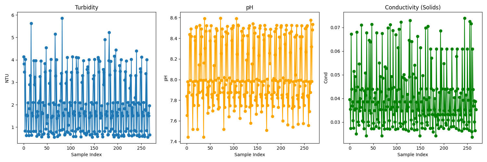

# Lake Water Quality Prediction System
**End-to-End ML + IoT Project with ESP32 Deployment**

---

## 🚩 Project Overview

This project predicts three crucial lake water quality parameters — **pH, Turbidity, and Conductivity** — using machine learning, and deploys the predictive models on an ESP32-based hardware system with real-time sensors and OLED display.

The workflow covers:
- Large-scale data collection and cleaning
- Model training and evaluation (XGBoost, LightGBM, SARIMA)
- Model selection and export for microcontroller
- Arduino/ESP32 firmware for field deployment

---

## 📊 Data & Problem Statement

- **Dataset:**  
  - ~80,000 lake locations  
  - Records from 2000 to 2023  
  - Each record: pH, Turbidity (NTU), Conductivity (TDS, µS/cm)
- **Approach:**  
  - For prototyping, a single representative location's time series data was selected and extracted
  - Data cleaning included outlier removal and gap-filling

### **Before and After Data Cleaning**

| Before Cleaning            | After Cleaning           |
|---------------------------|-------------------------|
|  |  |

---

## 🧠 Model Training & Evaluation

### **1. Models Compared**

| Algorithm    | Model Type                | Main Loss Function          | Description                                |
|--------------|--------------------------|-----------------------------|--------------------------------------------|
| XGBoost      | Gradient Boosting (Tree) | Mean Squared Error (MSE)    | Sequential boosting, robust for tabular data|
| LightGBM     | Gradient Boosting (Tree) | Mean Squared Error (MSE)    | Fast, memory-efficient boosting            |
| SARIMA       | Time Series (ARIMA)      | Maximum Likelihood / MSE    | Classical time-series for univariate trends |

#### **Details:**
- **XGBoost & LightGBM** are ensemble methods that use gradient boosting of decision trees to minimize MSE in regression tasks.
- **SARIMA** is a statistical model for time series forecasting, using only the history of the target variable itself.

### **2. Training Workflow**

- **Input features:** current month's pH, Turbidity, Conductivity
- **Targets:** next month's pH, Turbidity, Conductivity
- **Train/test split:** 80/20
- **Hyperparameters:** Defaults used as further tuning did not improve real-world performance

### **3. Model Comparison Table (MSE)**

| Parameter | LightGBM_MSE | XGBoost_MSE | SARIMA_MSE | Selected Model |
|-----------|--------------|-------------|------------|---------------|
| pH_next   | 0.02148      | 0.02107     | 0.09094    | XGBoost       |
| Tur_next  | 0.22462      | 0.16435     | 1.31170    | XGBoost       |
| Cond_next | 0.00007      | 0.00007     | 0.00016    | XGBoost       |

**Result:**  
XGBoost was selected for all three parameters due to the lowest or equal MSE.

---

## 🖥️ FastAPI Web Demo

A demo web interface is provided for manual entry and prediction (see `main.py`).

**Run locally:**
```bash
python -m venv venv
source venv/bin/activate  # or venv\Scripts\activate on Windows
pip install -r requirements.txt
uvicorn main:app --reload
````

Visit [http://localhost:8000](http://localhost:8000).

---

## 🕹️ Model Export & Microcontroller Deployment

### **1. Model Export for Embedded Use**

* Each trained XGBoost model was exported using [m2cgen](https://github.com/BayesWitnesses/m2cgen) as C header files for Arduino:

  * `model_xgb_ph.h`
  * `model_xgb_tur.h`
  * `model_xgb_cond.h`

### **2. Hardware Setup**

* **Microcontroller:** ESP32-WROOM-32 (4MB)
* **Sensors:**

  * pH sensor/probe (0–14)
  * Turbidity sensor (NTU)
  * TDS/Conductivity sensor (µS/cm)
* **Display:** 0.96" SSD1306 OLED (I2C)
* **User Interface:** 3 push buttons (Next, OK, Back)

### **3. Firmware Design**

* **Menu-driven UI**: User steps through each sensor, views real-time readings, confirms by pressing "OK"
* **Prediction**: After collecting all three values, user can trigger prediction with a button press
* **Display**: Predicted next-month values shown on OLED; user can restart cycle

#### **Main Features:**

* Interactive, user-friendly hardware UI
* Real-time sensor reading and display
* Machine learning inference on-device with no cloud required

---

## 🔌 Arduino Code Structure

* **Main file** (`.ino` or `.cpp`):

  * Handles menu logic, sensor reading, display updates
  * Uses model headers for ML inference
* **Model headers**: `model_xgb_ph.h`, `model_xgb_tur.h`, `model_xgb_cond.h` (generated via m2cgen)

**Display code is modularized for easy updates and maintenance.**

---

## 🧩 File Structure

```
.
├── data/
│   └── location_10_realtime_model_data.csv
├── models/
│   ├── xgboost_pH_next.json
│   ├── xgboost_Tur_next.json
│   ├── xgboost_Cond_next.json
│   ├── model_xgb_ph.h
│   ├── model_xgb_tur.h
│   └── model_xgb_cond.h
├── Small_Model/
│   ├── main.py
│   ├── model_comparison.py
│   ├── read_plot.py
│   ├── Figure_1.png
│   └── Figure_2.png
├── arduino/
│   ├── water_quality_predictor.ino
│   ├── model_xgb_ph.h
│   ├── model_xgb_tur.h
│   └── model_xgb_cond.h
└── README.md
```

---

## ⚡ How to Reproduce

1. **Data Preparation & Cleaning:**

   * Place CSV in `/data`
   * Run Python scripts for cleaning and exploratory analysis

2. **Model Training:**

   * Run `model_comparison.py` to train and compare models
   * Export selected XGBoost models as `.json`, then use `m2cgen` to generate `.h` files

3. **Microcontroller Deployment:**

   * Copy generated `.h` files to Arduino project
   * Upload Arduino code to ESP32
   * Connect sensors, OLED, and buttons per wiring diagram

---

## 📝 References

* [XGBoost Documentation](https://xgboost.readthedocs.io/)
* [LightGBM Documentation](https://lightgbm.readthedocs.io/)
* [m2cgen: Model to Code Generator](https://github.com/BayesWitnesses/m2cgen)
* [Adafruit SSD1306 OLED Library](https://github.com/adafruit/Adafruit_SSD1306)
* [Lake Water Quality Datasets](https://www.nature.com/articles/s41597-025-04915-y) 

---

## 👤 Author

**Sahas Eashan**
University of Moratuwa, Sri Lanka

---

## 🚀 Future Work

* Extend to multiple locations and real-time streaming
* Add data logging, wireless upload, or alerting features
* Experiment with other ML models and deployment strategies

---

```

---

- **Update the paths to images if your folder structure is different.**
- If you want to add code snippets or diagrams, let me know!
- You can always further tweak the algorithm section if you want to discuss regularization, tree parameters, etc.

Let me know if you want a version with more technical depth on any specific ML algorithm!
```
